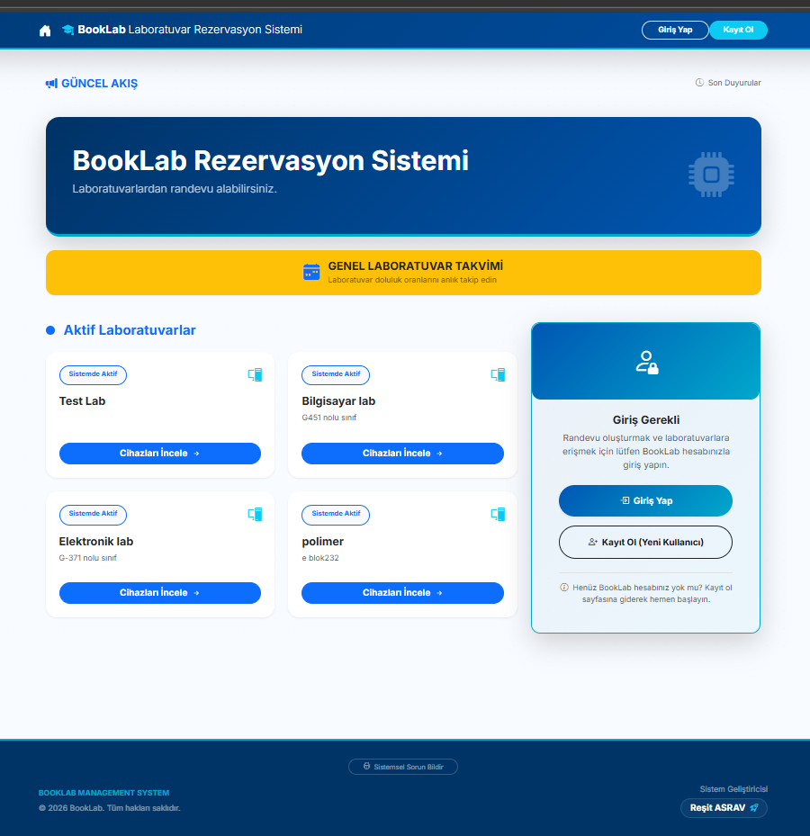
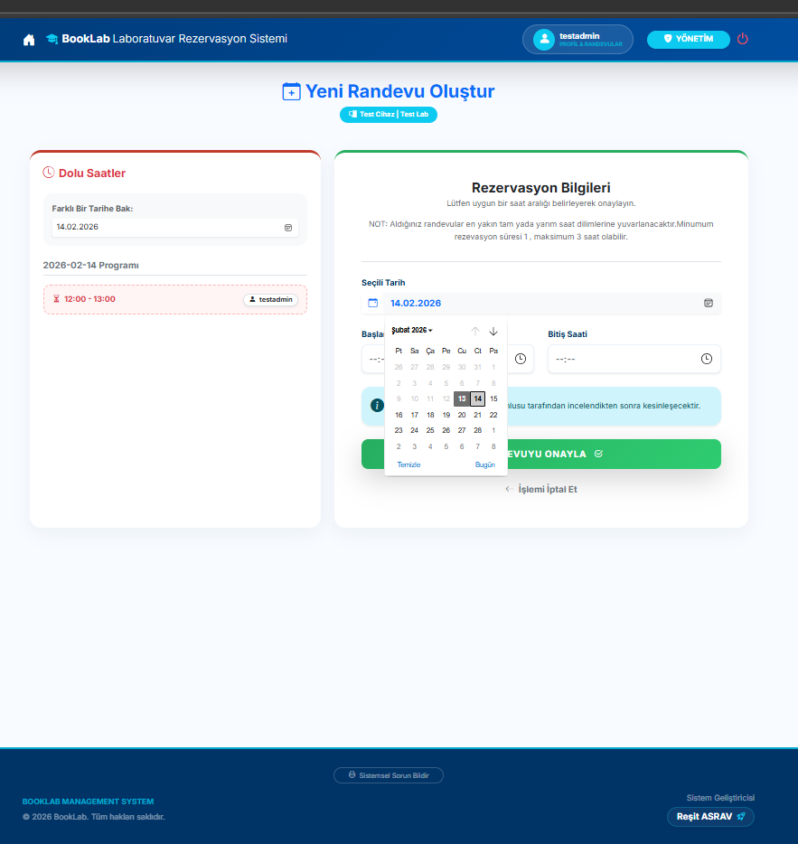
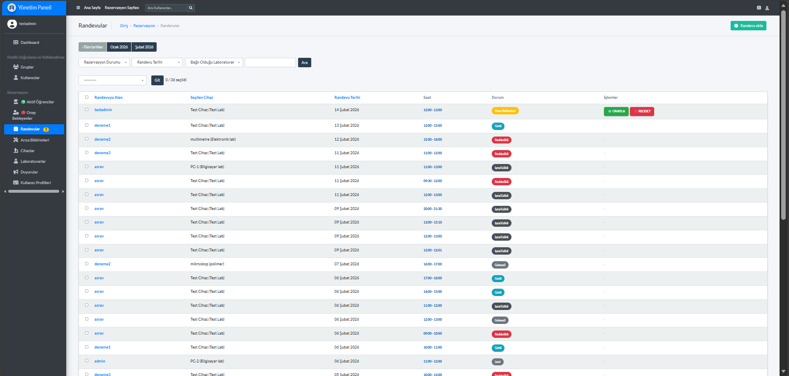
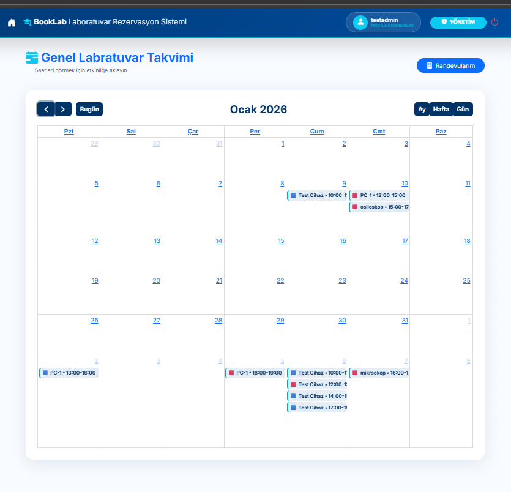
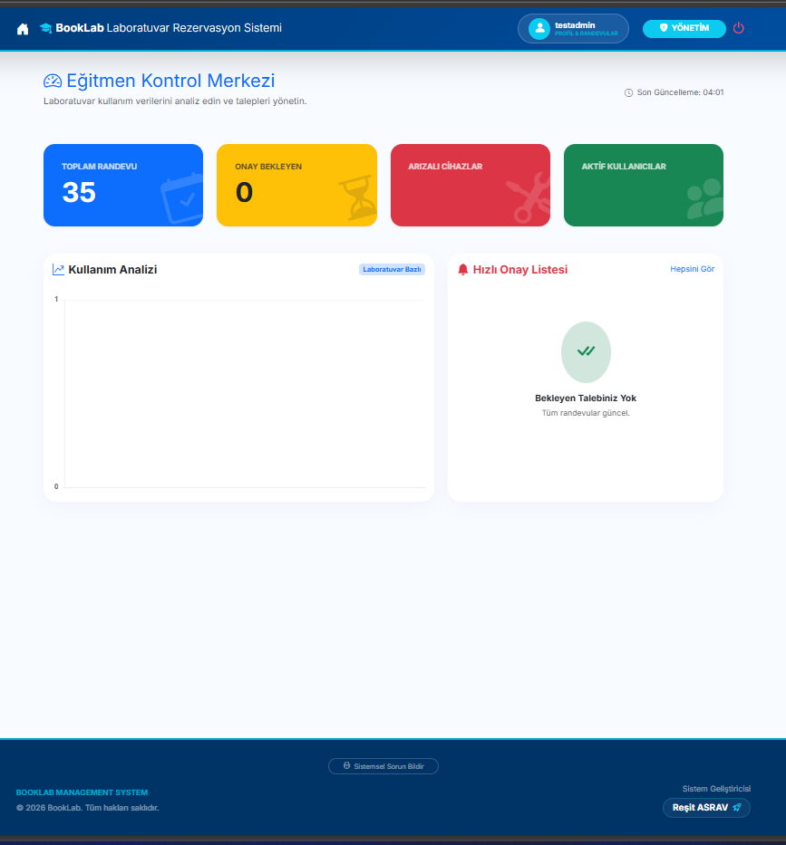

<div align="center">

# 🧪 BookLab-System
### *Bursa Teknik Üniversitesi Laboratuvar Rezervasyon ve Yönetim Ekosistemi*

[](https://www.python.org/)
[](https://www.djangoproject.com/)
[](https://www.sqlite.org/)
[](https://opensource.org/licenses/MIT)


**BookLab**, üniversite laboratuvar kaynaklarının verimli, adil ve güvenli bir şekilde yönetilmesini sağlayan, üretim aşamasına hazır (production-ready) bir web platformudur.

[🌐 Canlı Demo](https://asravresit.pythonanywhere.com/) | [📚 Dokümantasyon](#) | [🐞 Hata Bildir](#)

</div>

---

## 📖 Proje Hakkında

Laboratuvar saatlerinin ve cihaz kullanımının manuel takibi, çakışmalara ve kaynak israfına yol açar. **BookLab**, BTÜ öğrencileri ve akademisyenleri için merkezi bir randevu sistemi sunar. Sistem, sadece kayıt değil, aynı zamanda **idari onay mekanizması** ve **akıllı çakışma denetimi** ile tam kontrol sağlar.

---

## ✨ Öne Çıkan Özellikler

### 🔐 Gelişmiş Güvenlik ve Doğrulama
- **Pasif-Aktif Üyelik Akışı:** Yeni kayıt olan öğrenciler otomatik olarak "Pasif" statüsünde başlar.
- **E-Posta Doğrulaması:** Kayıt sırasında gönderilen 6 haneli kod ile gerçek kullanıcı doğrulaması yapılır.
- **Admin Onay Mekanizması:** Erişim, sadece yönetici tarafından manuel onay verildikten sonra açılır (`is_active`).

### 📅 Rezervasyon Yönetimi
- **Çakışma Önleyici Takvim:** Aynı saat dilimine mükerrer randevu alınmasını engeller.
- **Cihaz Bazlı Takip:** Sadece laboratuvar değil, laboratuvar içindeki spesifik cihazlar için de randevu oluşturulabilir.

### 🛠 Yönetim Paneli (AdminLTE Entegrasyonu)
- **Merkezi Kontrol:** Kullanıcılar, laboratuvarlar, cihazlar ve tüm randevular tek bir ekrandan yönetilir.
- **Hızlı Aksiyonlar:** Toplu öğrenci onayı ve durum güncelleme özellikleri.

---

## 📸 Ekran Görüntüleri

<div align="center">

| Kayıt ve Giriş | Laboratuvar Seçimi |
|:---:|:---:|
|  |  |
| *Modern ve Sade Giriş Arayüzü* | *Kullanıcı Dostu Rezervasyon Ekranı* |

| Yönetim Paneli | Takvim Görünümü |
|:---:|:---:|
|  |  |
| *Detaylı İstatistikler ve Yönetim* | *Tüm Randevuların Genel Takibi* |

| Şifre Güvenliği | Kontrol Merkezi |
|:---:|:---:|
|  |  |
| *Güvenli Şifre Sıfırlama Akışı* | *Gelişmiş Filtreleme ve Arama* |

</div>

---

## 🚀 Teknoloji Yığını ve Yöntemler

### **Backend & Mantık**
- **Python 3.13 & Django:** Güçlü ve ölçeklenebilir bir mimari.
- **Django Signals:** Kullanıcı oluşturulduğunda otomatik profil oluşturma ve statü atama mantığı.
- **Python-Decouple:** `.env` dosyası üzerinden güvenli anahtar ve SMTP şifre yönetimi.

### **Frontend & Kullanıcı Deneyimi**
- **AdminLTE 3:** Profesyonel, duyarlı (responsive) yönetim paneli tasarımı.
- **Bootstrap 5:** Modern ve temiz kullanıcı arayüzü bileşenleri.
- **Custom CSS:** Kurumsal renk paleti (BTÜ Teması) entegrasyonu.

### **İletişim & Dağıtım**
- **Google SMTP:** TLS/SSL protokolü ile güvenli doğrulama e-postaları.
- **Git & GitHub:** Versiyon kontrolü ve CI/CD süreçleri.
- **PythonAnywhere:** Bulut tabanlı canlı yayınlama (deployment).

---

## 🛠 Kurulum ve Çalıştırma

1. **Depoyu Klonlayın**
   ```bash
   git clone [https://github.com/resitasrav/BookLab-System.git](https://github.com/resitasrav/BookLab-System.git)
   cd BookLab-System