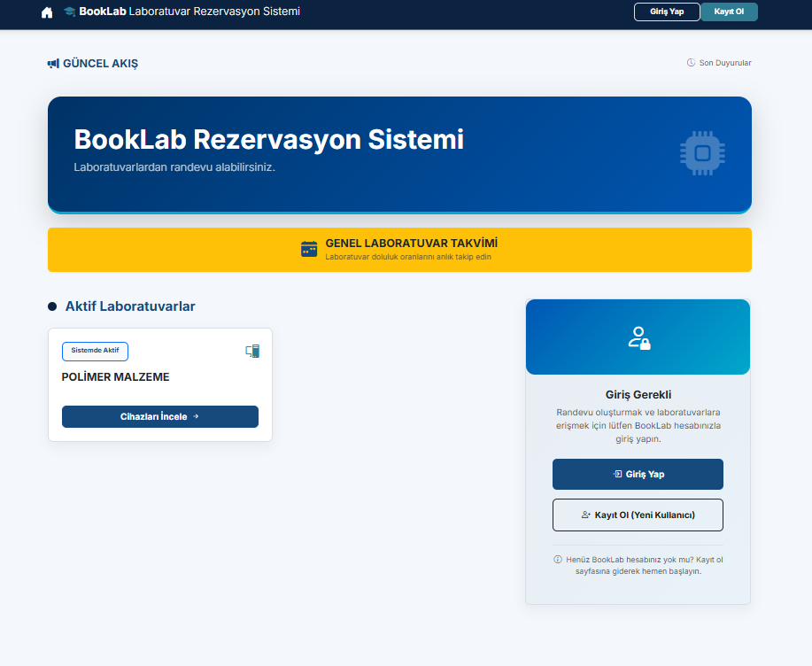
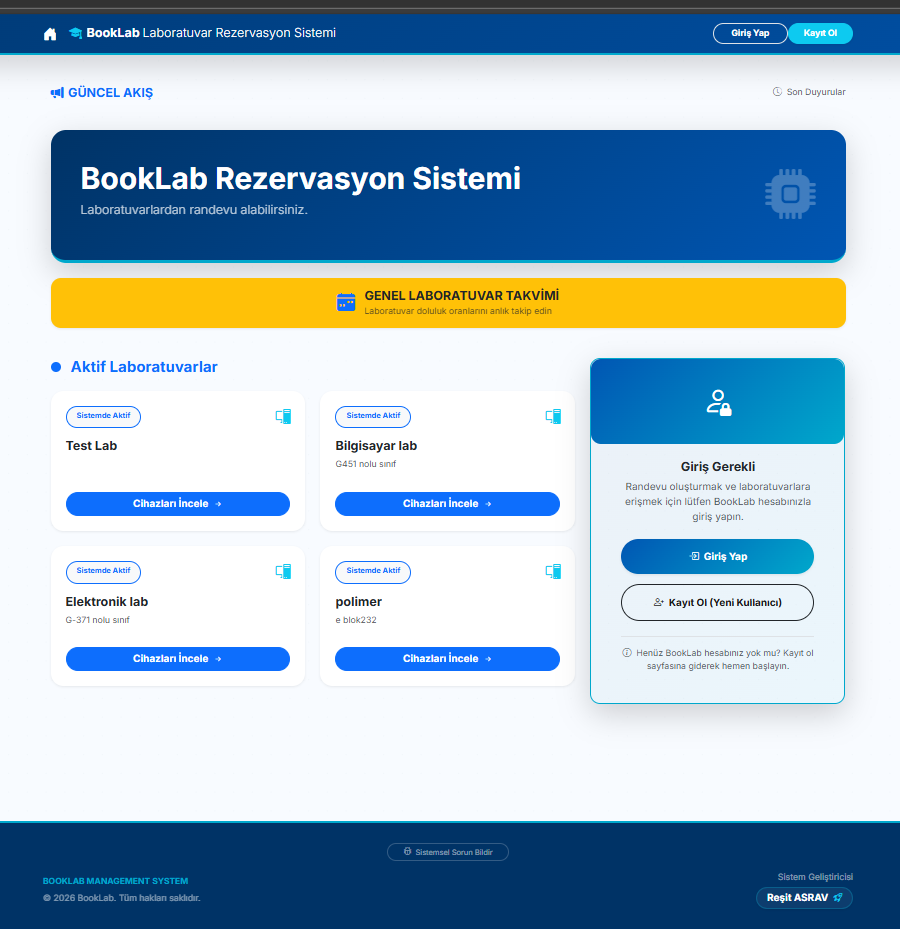
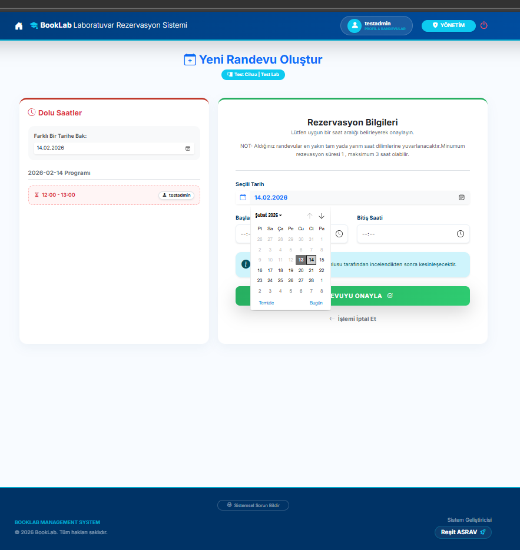
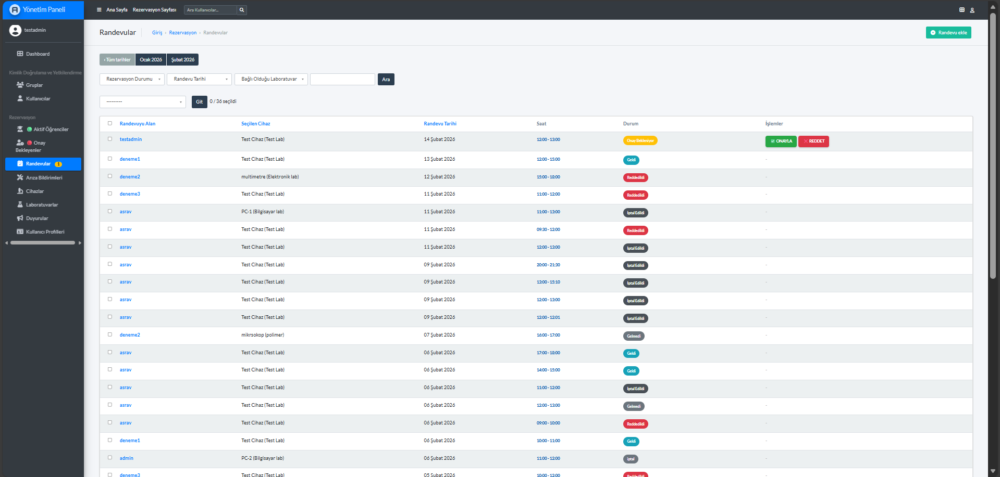
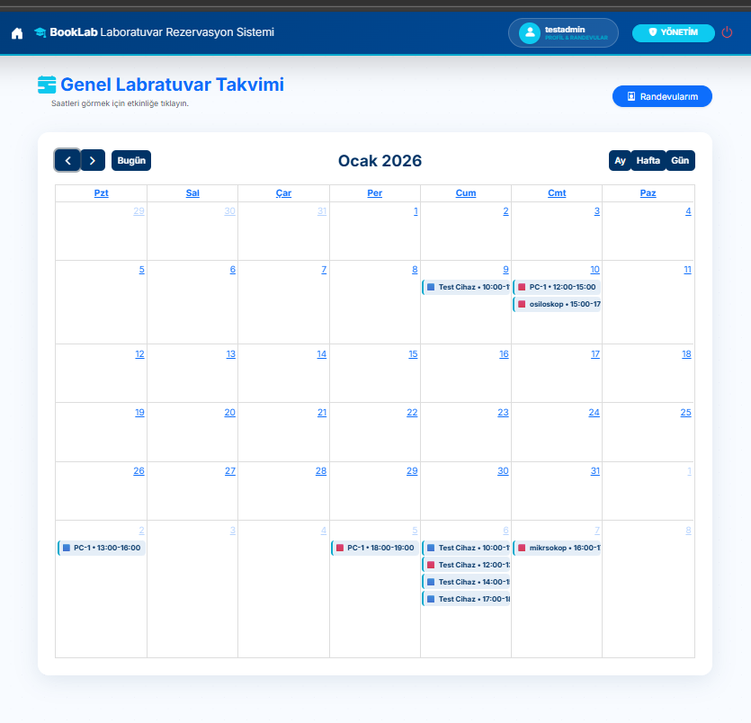
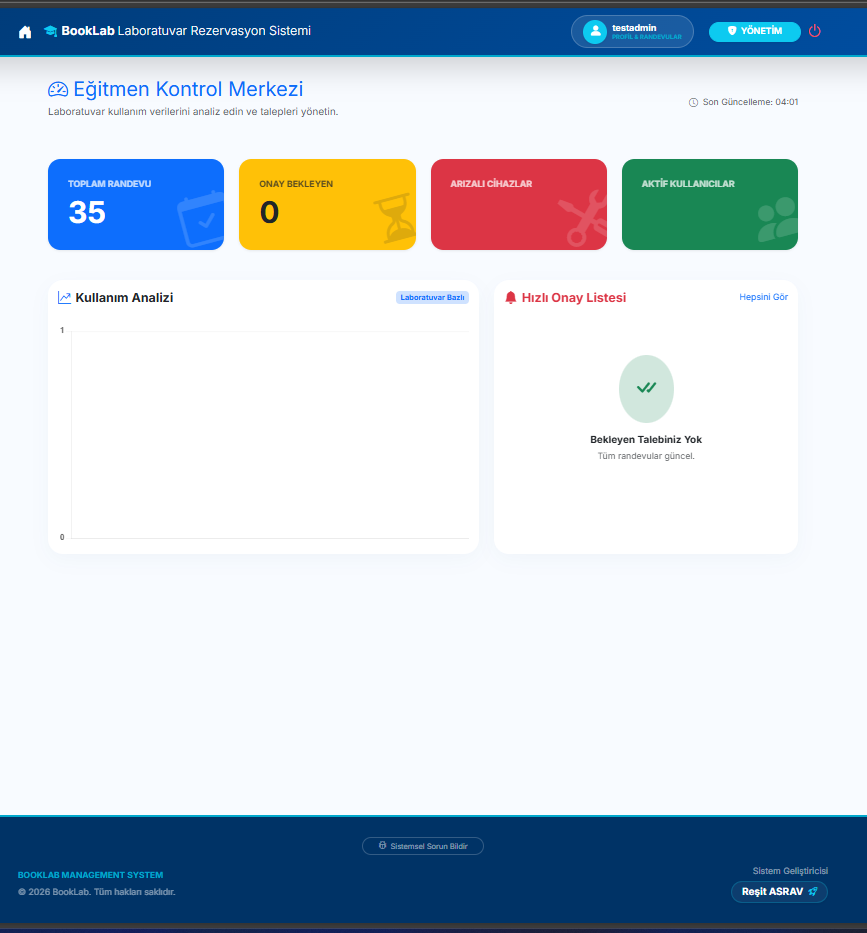

<div align="center">

# 🧪 BookLab-System
### *Laboratuvar Rezervasyon ve Yönetim Ekosistemi*

[](https://www.python.org/) 
[](https://www.djangoproject.com/) 
[](https://www.sqlite.org/) 
[](https://opensource.org/licenses/MIT) 
[](https://www.oracle.com/cloud/)



**BookLab**, üniversite laboratuvar kaynaklarının adil, verimli ve güvenli yönetilmesini sağlayan üretim aşamasına hazır bir web platformudur.  

[🌐 Canlı Demo](https://booklabtr.duckdns.org/) | [📚 Dokümantasyon](docs/README.md) | [👨‍💻 İletişim & Destek](https://www.linkedin.com/in/resitasrav)

</div>

---

## 📖 Proje Hakkında

Manuel laboratuvar takibi sık sık çakışmalara ve kaynak israfına yol açar.  
**BookLab**, üniversite öğrencileri ve akademisyenleri için merkezi bir laboratuvar randevu sistemi sunar. 
- Kullanıcı kaydı ve doğrulama  
- Akıllı çakışma önleyici rezervasyon sistemi  
- Yönetici onay mekanizması  
- Laboratuvar ve cihaz bazlı detaylı takip  

---

## ✨ Öne Çıkan Özellikler

### 🔐 Güvenlik ve Doğrulama
- **Pasif-Aktif Üyelik:** Yeni kullanıcılar pasif başlar, admin onayı ile aktifleşir.  
- **E-Posta Doğrulama:** 6 haneli kod ile gerçek kullanıcı doğrulaması.  
- **Admin Onayı:** Hesaplar yalnızca yönetici tarafından aktifleştirilir.

### 📅 Rezervasyon Yönetimi
- **Çakışma Önleyici Takvim:** Aynı saat diliminde mükerrer rezervasyon engellenir.  
- **Cihaz Bazlı Randevu:** Laboratuvar içi cihazların ayrı takibi.  

### 🛠 Yönetim Paneli (AdminLTE)
- **Merkezi Kontrol:** Kullanıcılar, laboratuvarlar ve rezervasyonlar tek ekran üzerinden yönetilir.  
- **Toplu İşlemler:** Öğrenci onayı, durum güncellemeleri ve filtreleme.  

---

## 📸 Ekran Görüntüleri

<div align="center">

| Kayıt & Giriş | Laboratuvar Seçimi |
|:---:|:---:|
|  |  |
| *Modern ve sade giriş arayüzü* | *Kullanıcı dostu rezervasyon ekranı* |

| Yönetim Paneli | Takvim Görünümü |
|:---:|:---:|
|  |  |
| *Detaylı istatistikler ve yönetim* | *Tüm randevuların genel takibi* |

| Şifre Güvenliği | Kontrol Merkezi |
|:---:|:---:|
|  |  |
| *Güvenli şifre sıfırlama akışı* | *Gelişmiş filtreleme ve arama* |

</div>

---

## 🚀 Teknoloji Yığını

### **Backend & Mantık**
- **Python 3.13 & Django 5.1** – Güçlü, ölçeklenebilir ve üretim hazır.  
- **Django Signals** – Otomatik profil oluşturma ve statü atama.  
- **Python-Decouple** – Güvenli ortam değişkenleri ve SMTP yönetimi.  

### **Frontend & UX**
- **AdminLTE 3 & Bootstrap 5** – Modern, duyarlı ve profesyonel kullanıcı arayüzü.  
- **Custom CSS** – Modern ve temaya uygun renk düzeni ile arayüz tasarımı.

### **İletişim & Deployment**
- **Google SMTP** – TLS/SSL ile güvenli e-posta doğrulaması.  
- **Git & GitHub** – Versiyon kontrolü ve CI/CD.  
- **Oracle Cloude** – Bulut tabanlı canlı yayın.  

---

## 🛠 Kurulum ve Çalıştırma

1. **Depoyu Klonlayın**
```bash 
git clone https://github.com/resitasrav/BookLab-System.git
cd BookLab-System
```
2. **Sanal Ortam Olştuurn**
```bash 
python -m venv venv
source venv/bin/activate  # Linux / MacOS
venv\Scripts\activate     # Windows

```
3. **Gerekli Paketleri Yükleyin**
```bash 
pip install -r requirements.txt

```
4. **Veritabanını Migrasyon ile Hazırlayın**
```bash 
python manage.py migrate

```
5. **Süper Kullanıcı Oluşturun**
```bash 
python manage.py createsuperuser

```
6. **Uygulamayı Çalıştırın**
```bash
#sanal ortam açık değilse : 
#source venv/bin/activate     # Linux / MacOS
#venv\Scripts\activate        # Windows
python manage.py runserver

 ```
 7. **localhost**
 ```bash
  http://127.0.0.1:8000/
 ```
