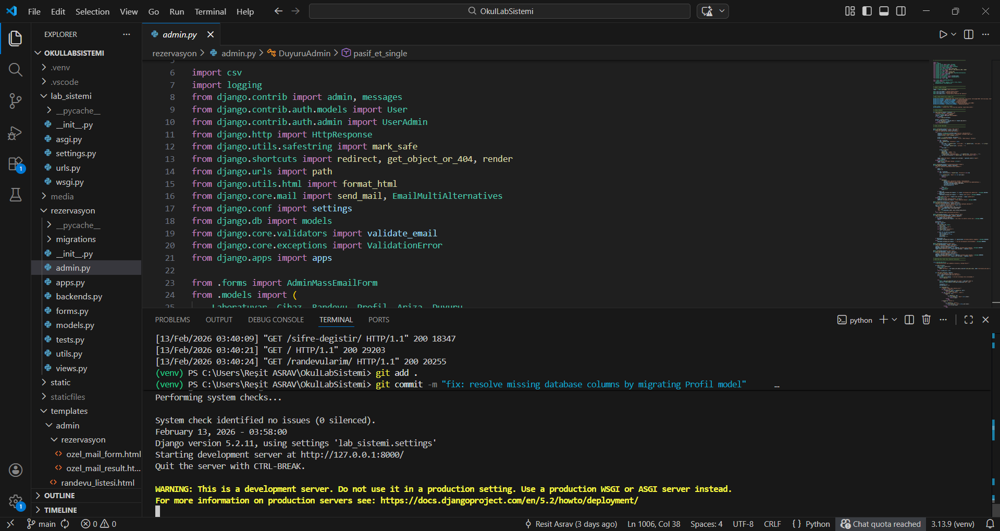

# 📚 BookLab Documentation Hub

  
   
  
<i>Bursa Teknik Üniversitesi Laboratuvar Randevu Sistemi Teknik ve Kullanıcı Rehberi Merkezi</i>

Merhaba! **BookLab** ekosistemine hoş geldiniz. Bu dokümantasyon merkezi, sistemin kurulumundan derin mimari detaylarına kadar ihtiyacınız olan tüm teknik ve pratik bilgileri barındırmaktadır. 

---

## 🗺️ Rehber Haritası

Sistemin hangi kısmıyla ilgileniyorsanız ilgili bağlantıya tıklayarak detaylı dokümana ulaşabilirsiniz:

| # | Bölüm | İçerik Özeti | Hedef Kitle |
| :-- | :--- | :--- | :--- |
| 01 | 🚀 **[Başlangıç Kılavuzu](01_getting_started.md)** | Kurulum, `.env` yapılandırması ve çalıştırma. | **Geliştiriciler** |
| 02 | 🎓 **[Kullanıcı Kılavuzu](02_user_guide.md)** | Randevu alma, profil doğrulama ve yönetim. | **Öğrenciler** |
| 03 | 🔐 **[Yönetici Rehberi](03_admin_guide.md)** | Kullanıcı onayı, raporlar ve cihaz yönetimi. | **Akademisyenler** |
| 04 | ⚙️ **[API & Backend](04_api_docs.md)** | Endpoint listesi, Logic yapısı ve fonksiyonlar. | **Geliştiriciler** |
| 05 | 🗄️ **[Veritabanı Yapısı](05_database.md)** | Modeller, ER Diyagramı ve tablo ilişkileri. | **DB Mimarları** |
| 06 | 🏗️ **[Mimari ve Akış](06_architecture.md)** | Component diagram ve sistem iş akışı şeması. | **Sistem Mimarları** |
| 07 | 💻 **[Geliştirici Rehberi](07_dev_guide.md)** | Kod standartları ve yeni özellik ekleme kuralları. | **Katılımcılar** |
| 08 | ❓ **[Sık Sorulan Sorular](08_faq.md)** | Bilinen sorunlar ve hızlı teknik çözümler. | **Herkes** |
| 09 | 📜 **[Changelog](09_changelog.md)** | Sürüm notları ve yapılan son değişiklikler. | **Herkes** |

---

## 🛠️ Temel İş Akışı (Quick Workflow)

BookLab, güvenliği ve hiyerarşiyi ön planda tutan bir yapıya sahiptir:

1.  **Doğrulama:** Kullanıcı kurumsal e-posta ve OTP ile doğrulanır.
2.  **Onay:** Profil **"Pasif"** olarak admin kuyruğuna düşer ve onay bekler.
3.  **Erişim:** Admin onayından sonra laboratuvar ve cihaz randevuları açılır.
4.  **Denetim:** Tüm süreçler AdminLTE tabanlı panel üzerinden izlenir.

---

## 📢 Önemli Bilgiler
> 💡 Bu dokümantasyon, projenin sürdürülebilirliği için sürekli güncellenmektedir.
> 
> 🔗 Ana proje sayfasına dönmek için: [Ana README.md](../README.md)

  BookLab bir <b>Reşit ASRAV</b> projesidir. &copy; 2026

